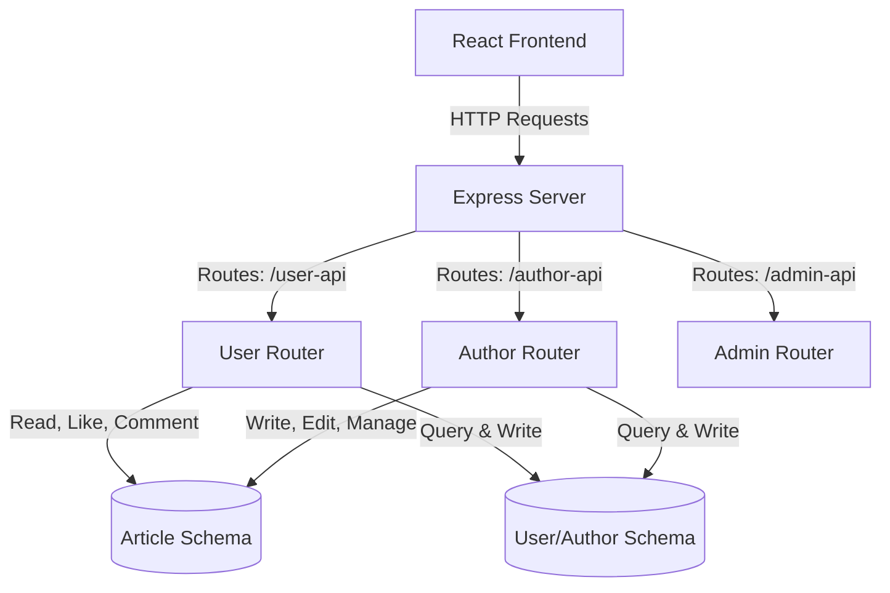

# BlogApp - Fullstack Blogging Platform

A fullstack web application featuring a blogging platform built with **React & Vite** on the frontend, and **Node.js, Express, & MongoDB** on the backend. The platform supports multiple roles (User, Author, Admin) and handles article management.

---

## 📁 Project Structure

```text
blogapp/
├── client/                 # React frontend (Vite)
│   ├── src/                # React components, pages & assets
│   ├── package.json        # Frontend dependencies
│   └── vite.config.js      # Vite configuration
│
└── server/                 # Express backend (API)
    ├── API/                # Express routes (APIs)
    │   ├── adminAPI.js     # Admin API endpoints
    │   ├── authorAPI.js    # Author API endpoints
    │   └── userAPI.js      # User API endpoints
    ├── Models/             # Mongoose schemas/models
    │   ├── Aritclemodel.js # Article schema
    │   └── userAuthormodel.js # User & Author shared schema
    ├── .env                # Backend environment variables
    ├── server.js           # Server entry point
    └── package.json        # Backend dependencies
```

---

## 🚀 Features & Capabilities

- **Multi-Role User Ecosystem**: Separate roles for standard readers (`User`), writers (`Author`), and supervisors (`Admin`).
- **Dynamic Cross-Role Checks**: The registration pipeline dynamically checks for email collisions across different user roles to prevent account duplication.
- **Robust Article Management**: A complete article life cycle featuring:
  - Author binding via MongoDB ObjectIds.
  - Active interactive features like reader comment arrays and like counters.
  - Tracking of publication (`createdAt`) and modification (`updatedAt`) dates.
  - Soft delete mechanism via `isActive` flags.

---

## 🏛️ Application Architecture & Roles

This application uses a modular, role-oriented architecture where components are divided by user capabilities:



### 👥 User Roles & Permissions

1. **Reader (User)**
   - Registered via the user router.
   - Can read published articles.
   - Can leave interactive comments on articles.
   - Can increment the like counter on posts.

2. **Writer (Author)**
   - Registered via the author router.
   - Responsible for creating and updating articles.
   - Associated directly with articles through a database reference field (`author` pointing to `userauthor`).

3. **Administrator (Admin)**
   - Oversees the blogging platform.
   - Accesses dashboard metrics and moderation endpoints via the admin router.

### 🛡️ Mongoose Schema Strict Mode

Both primary schemas in the backend are configured with strict schema checking enabled:
```javascript
{ "strict": "throw" }
```
This constraint ensures that:
- Any attempts to save attributes not defined in the mongoose schema will throw a database exception.
- Payload structures are strictly governed by the code definition, minimizing database pollution and ensuring structure consistency.

---

## 🛠️ Getting Started

### Prerequisites
- [Node.js](https://nodejs.org/) (v16.x or higher recommended)
- [MongoDB Atlas](https://www.mongodb.com/cloud/atlas) or a local MongoDB instance

---

### Backend Setup

1. Navigate to the `server/` directory:
   ```bash
   cd server
   ```

2. Install dependencies:
   ```bash
   npm install
   ```

3. Create/Configure the `.env` file inside `server/`:
   ```env
   PORT=3000
   MONGOURL=your_mongodb_connection_string
   ```

4. Start the server (using nodemon for hot reloading):
   ```bash
   npm run start   # or: nodemon server.js
   ```

---

### Frontend Setup

1. Navigate to the `client/` directory:
   ```bash
   cd client
   ```

2. Install dependencies:
   ```bash
   npm install
   ```

3. Start the development server:
   ```bash
   npm run dev
   ```

---

## 🔌 API Documentation

### 1. User API (`/user-api`)


| Endpoint | Method | Description |
| :--- | :--- | :--- |
| `/getusers` | `GET` | Retrieves all registered users with the role `"User"`. |
| `/registeruser` | `POST` | Registers a new user. Returns error message if email already exists as a User or Author. |

### 2. Author API (`/author-api`)


| Endpoint | Method | Description |
| :--- | :--- | :--- |
| `/getauthors` | `GET` | Retrieves all registered authors with the role `"Author"`. |
| `/registerauthor` | `POST` | Registers a new author. Returns error message if email already exists. |

### 3. Admin API (`/admin-api`)


| Endpoint | Method | Description |
| :--- | :--- | :--- |
| `/` | `GET` | Test route for admin dashboard functions. |

---

## 🗃️ Database Schemas

### User/Author Model (`userauthor`)

- `role`: String (`"User"`, `"Author"`, or `"Admin"`) - Required
- `firstName`: String - Required
- `lastName`: String - Required
- `email`: String (Unique) - Required
- `profileImageUrl`: String
- `isActive`: Boolean (Default: `true`)

### Article Model (`articlemodel`)

- `title`: String - Required
- `content`: String - Required
- `author`: ObjectId (References `userauthor`) - Required
- `createdAt` / `updatedAt`: Date (Default: `Date.now`)
- `isActive`: Boolean (Default: `true`)
- `likes`: Number (Default: `0`)
- `comments`: Array of `{ username, comment, createdAt }` objects
